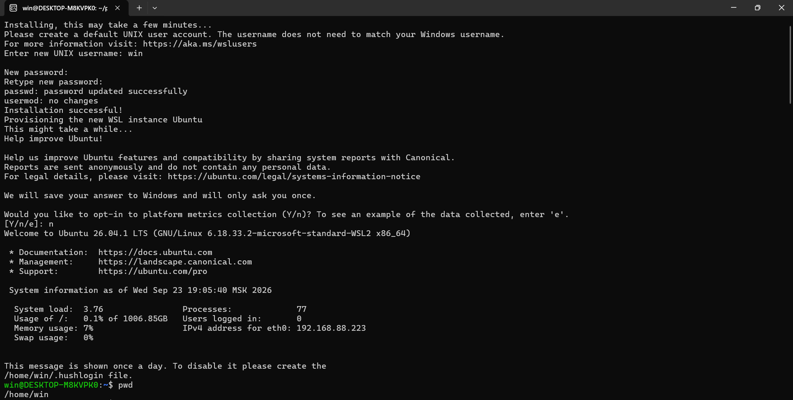
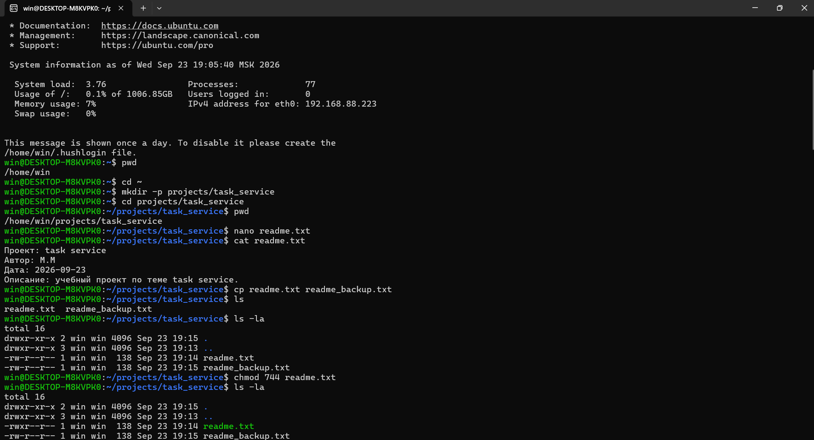
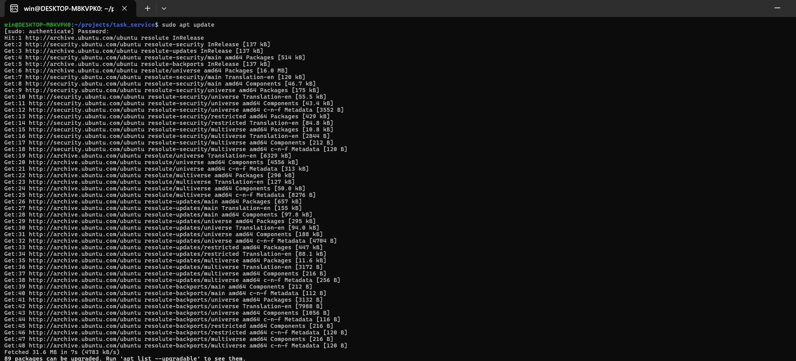
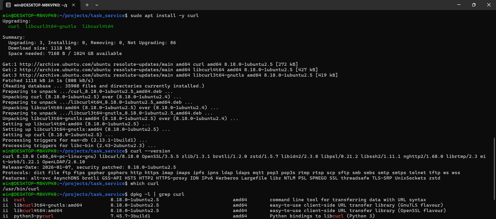
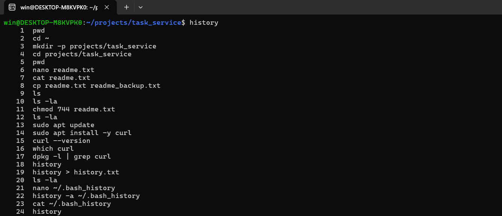

# Linux Report — Task Service

**Автор:** М. М.  
**Дата:** 2026-09-23  
**Окружение:** Ubuntu 26.04.1 LTS (WSL2) на Windows 11  
**Тема проекта:** Task Service

---

## Содержание

1. [Тема проекта](#1-тема-проекта)
2. [Запущенная Ubuntu](#2-запущенная-ubuntu)
3. [Рабочая папка и файлы](#3-рабочая-папка-и-файлы-проекта)
4. [Права доступа и chmod](#4-права-доступа-и-их-изменение-через-chmod)
5. [Установка пакета через apt](#5-установка-пакета-через-apt)
6. [История выполненных команд](#6-история-выполненных-команд)
7. [Список использованных команд](#7-итоговый-список-использованных-команд)
8. [Выводы](#8-выводы)

---

## 1. Тема проекта

**Task Service** — учебный проект. В рамках работы в Ubuntu создана рабочая папка проекта, текстовый файл с описанием, его резервная копия, изменены права доступа, установлен пакет `curl` через `apt`.

---

## 2. Запущенная Ubuntu

Система установлена в WSL2. В терминале видно:

- приветствие Ubuntu 26.04.1 LTS (GNU/Linux 6.18.33.2-microsoft-standard-WSL2 x86_64);
- имя пользователя `win` и хост `DESKTOP-M8KVPK0`;
- домашний каталог `/home/win`.



**Скриншот 1.** Запущенная Ubuntu 26.04.1 LTS (WSL2). Приглашение `win@DESKTOP-M8KVPK0:~$`.

---

## 3. Рабочая папка и файлы проекта

Создана структура каталогов:

```
/home/win/projects/task_service/
```

Путь подтверждён командой `pwd`. Создан текстовый файл `readme.txt` со следующим содержимым:

```
Проект: task service
Автор: М. М.
Дата: 2026-09-23
Описание: учебный проект по теме task service.
```

Затем сделана копия файла — `readme_backup.txt` (команда `cp readme.txt readme_backup.txt`).

Список файлов в папке (`ls`):

```
readme.txt  readme_backup.txt
```



**Скриншот 2.** Рабочая папка `~/projects/task_service`, файлы `readme.txt` и `readme_backup.txt`, права доступа до и после `chmod 744`.

---

## 4. Права доступа и их изменение через chmod

### 4.1. Права до chmod

Вывод `ls -la`:

```
total 16
drwxr-xr-x 2 win win 4096 Sep 23 19:15 .
drwxr-xr-x 3 win win 4096 Sep 23 19:13 ..
-rw-r--r-- 1 win win  138 Sep 23 19:14 readme.txt
-rw-r--r-- 1 win win  138 Sep 23 19:15 readme_backup.txt
```

Права `-rw-r--r--` означают:

- владелец (`win`) — чтение и запись;
- группа (`win`) — только чтение;
- остальные — только чтение.

### 4.2. Изменение прав

```bash
chmod 744 readme.txt
```

- `7` = `rwx` — владельцу добавлено право на выполнение;
- `4` = `r--` — группе только чтение;
- `4` = `r--` — остальным только чтение.

### 4.3. Права после chmod

Вывод `ls -la`:

```
total 16
drwxr-xr-x 2 win win 4096 Sep 23 19:15 .
drwxr-xr-x 3 win win 4096 Sep 23 19:13 ..
-rwxr--r-- 1 win win  138 Sep 23 19:14 readme.txt
-rw-r--r-- 1 win win  138 Sep 23 19:15 readme_backup.txt
```

Права `readme.txt` изменились с `-rw-r--r--` на `-rwxr--r--`. Права `readme_backup.txt` не тронуты.

---

## 5. Установка пакета через apt

### 5.1. Обновление списка пакетов

```bash
sudo apt update
```

Вывод: `Fetched 31.6 MB in 7s (4783 kB/s)`, `89 packages can be upgraded`.



**Скриншот 3.** Обновление списка пакетов: `sudo apt update`.

### 5.2. Установка пакета `curl`

```bash
sudo apt install -y curl
```

Apt подтвердил работу с пакетами `curl`, `libcurl4t64`, `libcurl3t64-gnutls`. Проверка установки:

```bash
curl --version
which curl
dpkg -l | grep curl
```

Результат:

```
curl 8.18.0 (x86_64-pc-linux-gnu) libcurl/8.18.0 OpenSSL/3.5.5 ...
/usr/bin/curl
ii  curl  8.18.0-1ubuntu2.5  amd64  command line tool for transferring data with URL syntax
```



**Скриншот 4.** Установка пакета `curl` через `apt` и проверка: `curl 8.18.0`, путь `/usr/bin/curl`, запись в `dpkg -l`.

---

## 6. История выполненных команд

Полный список команд сессии (`history`):

```
  1  pwd
  2  cd ~
  3  mkdir -p projects/task_service
  4  cd projects/task_service
  5  pwd
  6  nano readme.txt
  7  cat readme.txt
  8  cp readme.txt readme_backup.txt
  9  ls
 10  ls -la
 11  chmod 744 readme.txt
 12  ls -la
 13  sudo apt update
 14  sudo apt install -y curl
 15  curl --version
 16  which curl
 17  dpkg -l | grep curl
 18  history
 19  history > history.txt
 20  ls -la
 21  history -a ~/.bash_history
 22  cat ~/.bash_history
 23  history
```



**Скриншот 5.** История выполненных команд (`history`).

---

## 7. Итоговый список использованных команд

```bash
# Навигация и структура
pwd
cd ~
mkdir -p projects/task_service
cd projects/task_service
pwd

# Работа с файлом
nano readme.txt
cat readme.txt

# Копирование и листинг
cp readme.txt readme_backup.txt
ls
ls -la

# Права доступа
chmod 744 readme.txt
ls -la

# Установка пакета
sudo apt update
sudo apt install -y curl
curl --version
which curl
dpkg -l | grep curl

# История
history
history > history.txt
ls -la
history -a ~/.bash_history
cat ~/.bash_history
history
```

---

## 8. Выводы

В ходе работы:

1. Установлена и запущена Ubuntu (WSL2).
2. Создана структура каталогов для проекта по теме **Task Service**.
3. Создан текстовый файл `readme.txt`, сделана его копия `readme_backup.txt`.
4. Изучены права доступа через `ls -la`, изменены права через `chmod 744`.
5. Установлен пакет `curl` через `sudo apt install`.
6. Зафиксирована история выполненных команд.

Все пункты задания выполнены.